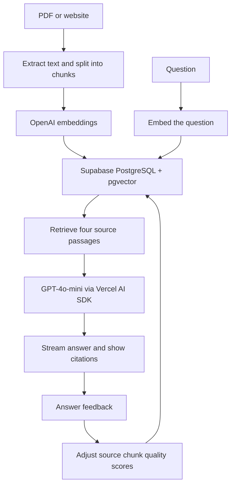

# AskBase

Ask questions about PDFs and websites, with streamed answers and sources you can inspect.

A personal project exploring the full document Q&A flow: import content, retrieve relevant passages, generate an answer, and collect feedback.

**[Try the demo](https://ask.saumyat.com) · [Read the case study](https://www.saumyat.com/projects/askbase) · [Watch the recording](demo.mp4)**


## What it does

- Extracts text from PDFs and imports pages from websites, with progress updates.
- Stores document chunks and OpenAI embeddings in Supabase PostgreSQL with pgvector.
- Streams answers with numbered citations and clickable source details.
- Collects thumbs up/down feedback and adjusts the ranking of referenced chunks.
- Shows query history, feedback rates, frequently retrieved chunks, and possible knowledge gaps in an admin dashboard.
- Saves chat locally and reads older stored conversations after the AI SDK migration.

## How it works



### Engineering choices

| Choice | Reason and tradeoff |
| --- | --- |
| PostgreSQL + pgvector | Keep documents, vectors, queries, and feedback together. Vector search shares resources with application queries. |
| Source details alongside answers | Make answers easier to inspect. A citation is not an automatic correctness guarantee. |
| Streaming import and chat | Show progress during longer operations. Client state needs to handle partial results and errors. |
| Feedback-adjusted retrieval | Explore how user feedback can inform ranking. End-to-end feedback cannot separate retrieval errors from generation errors. |
| Legacy message normalization | Preserve local conversations when moving to the Vercel AI SDK message format. |

**Stack:** Next.js 14, React, TypeScript, Tailwind CSS, Supabase PostgreSQL, pgvector, OpenAI embeddings, and Vercel AI SDK for chat. The OpenAI SDK handles embeddings directly; chat uses `@ai-sdk/openai`.

## Run locally

### 1. Install

```bash
npm ci
```

### 2. Create a Supabase database

Run these files in order in the Supabase SQL Editor:

1. `supabase/migrations/0001_init.sql` — base tables and vector search.
2. `supabase/migrations/0002_add_url_source.sql` — URL source fields.
3. `supabase/migrations/0003_match_chunks_url.sql` — URL details in search results.
4. `supabase/migrations/0004_feedback_quality.sql` — feedback scores and usage statistics.
5. `supabase/migrations/0005_device_id.sql` — device tracking and optional retrieval filtering.

### 3. Configure the server

Create `.env.local`:

```dotenv
OPENAI_API_KEY=your_openai_api_key
SUPABASE_URL=https://your_project.supabase.co
SUPABASE_SERVICE_ROLE_KEY=your_server_side_service_role_key
```

Keep the service role key server-side. Do not put it in a `NEXT_PUBLIC_` variable or commit `.env.local`.

Both services are needed for the complete import and chat flow. Without Supabase, data is not persisted; without OpenAI, chat returns a configuration error and the embedding helper currently falls back to zero vectors. Configure OpenAI before importing documents.

### 4. Start

```bash
npm run dev
```

- `http://localhost:3000` — landing page.
- `http://localhost:3000/app` — document Q&A workspace.
- `http://localhost:3000/admin` — prototype monitoring dashboard.

For a production build:

```bash
npm run build
npm start
```

## Prototype limits

This is a working prototype, not a private document workspace. Document listing and chat retrieval currently use a shared corpus, and admin routes are not authenticated. Device identifiers are tracking data, not an access-control boundary. Use public or sample documents for the demo.

Next improvements:

- Authentication, protected admin routes, and enforced document access throughout the API and retrieval path.
- A retrieval evaluation set with known source passages, followed by hybrid search and reranking experiments.
- Grounding checks for citations and query rewriting for follow-up questions. Retrieval currently embeds only the latest user message.
- Better handling of large documents, failed imports, and repeated feedback.

Reliability checks added: bounded overlapping chunks, stable citation numbers with full passage previews, explicit dependency failures, upload size/text validation, and import storage errors. Run `npm test` for the regression suite. These checks use mocked services; they do not measure live model accuracy.

No benchmark for answer accuracy, retrieval quality, or latency has been published. Feedback-driven ranking is implemented; its effect on answer quality has not been measured.

## Code map

| Area | Files |
| --- | --- |
| PDF and website import | `app/api/upload/route.ts`, `app/api/crawl/route.ts`, `lib/crawl.ts` |
| Chunking, embeddings, retrieval | `lib/chunking.ts`, `lib/embeddings.ts`, `lib/retrieval.ts` |
| Streamed answers and sources | `app/api/chat/route.ts`, `components/Chat.tsx` |
| Feedback and monitoring | `app/api/feedback/route.ts`, `app/api/admin/`, `components/AdminStats.tsx` |
| Database functions | `supabase/migrations/` |

## Deploy to Vercel

Import the repository, configure the three server-side variables above, apply all five migrations, and deploy. For use with private data or untrusted users, implement the access controls described above first.

## Demo preparation

See [the 60-second demo script](docs/demo-script.md) for a suggested recording sequence and sample document.

## License

The previous README described the project as MIT licensed, but this checkout does not include a standalone license file. Confirm the intended license before relying on that statement.
